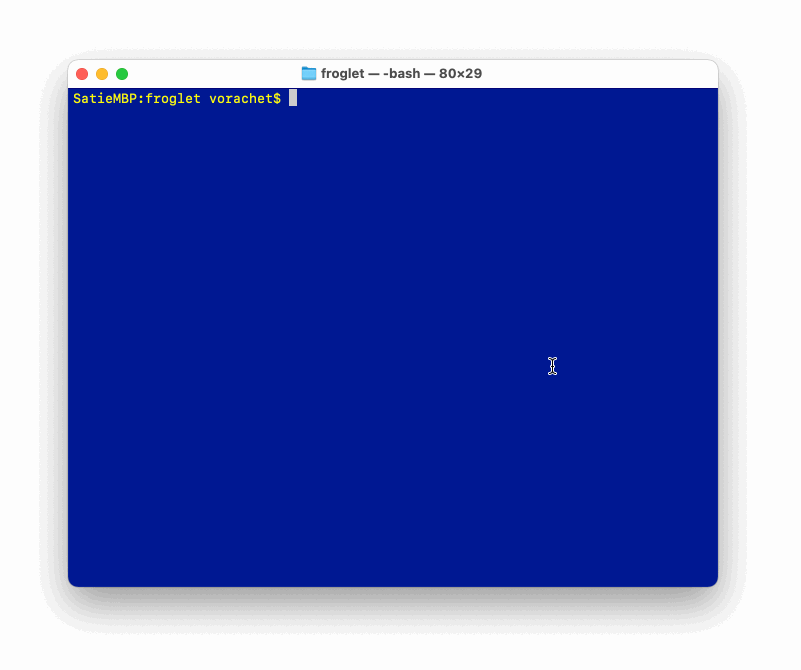

# FROGLET

Automation workflow for GSL (https://github.com/imatix/gsl)

## Fixed directory names

```
.
├── README.md
├── froglet.sh                  # Froglet script provides you the workflow
├── generators                  # fixed folder name for storing genrators
│   └── js_helloworld
│       ├── index.gsl
│       └── program.gsl
├── models                      # fixed folder name for storing models
│   └── my_helloworld.xml
```

# Usage



## Writing a model 

Put your GSL models in models folder.

## Writing a generator

Generator term with this project is a collection of GSL templates saved in one folder for generating specific artifacts. 

Each generator will be a command with Froglet that work with a GSL model file.

## Executing a generation job

The Froglet script provides you a workflow to execute a generation job. Each job will require one model and one generator. 